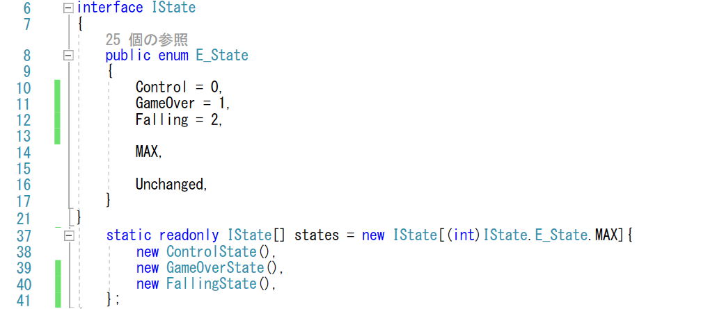
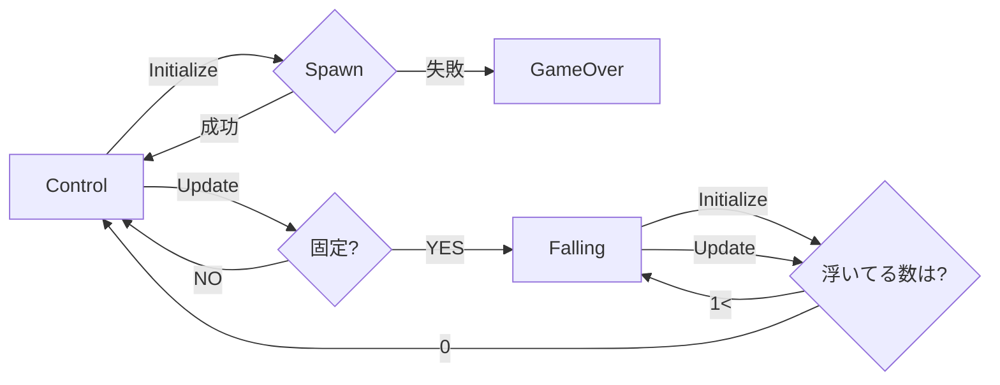
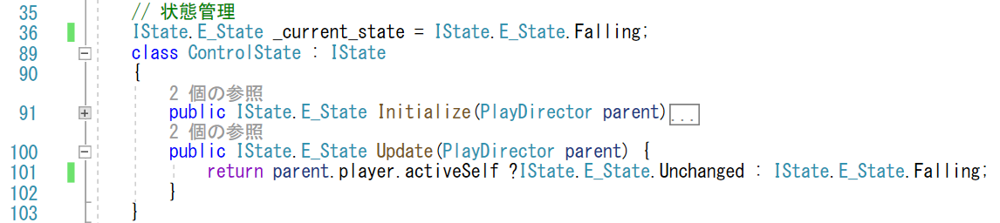
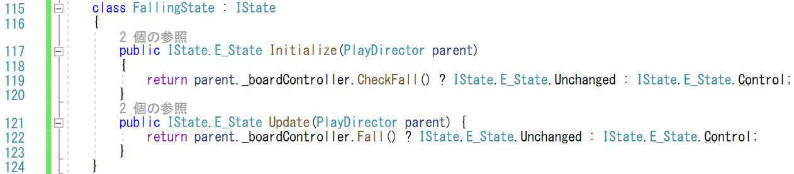
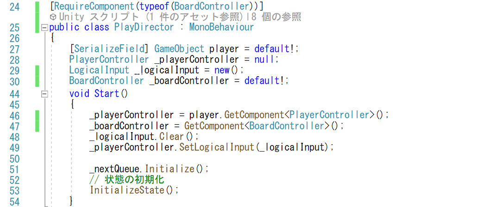
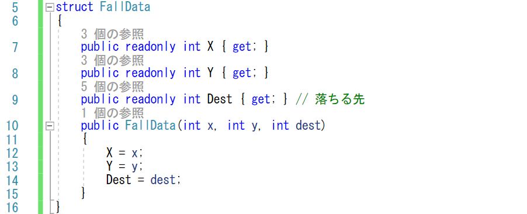
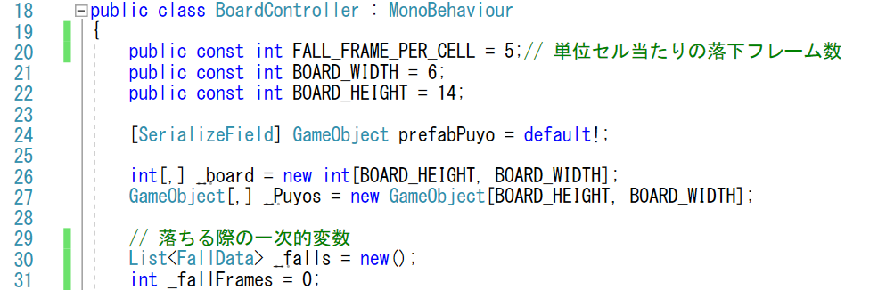
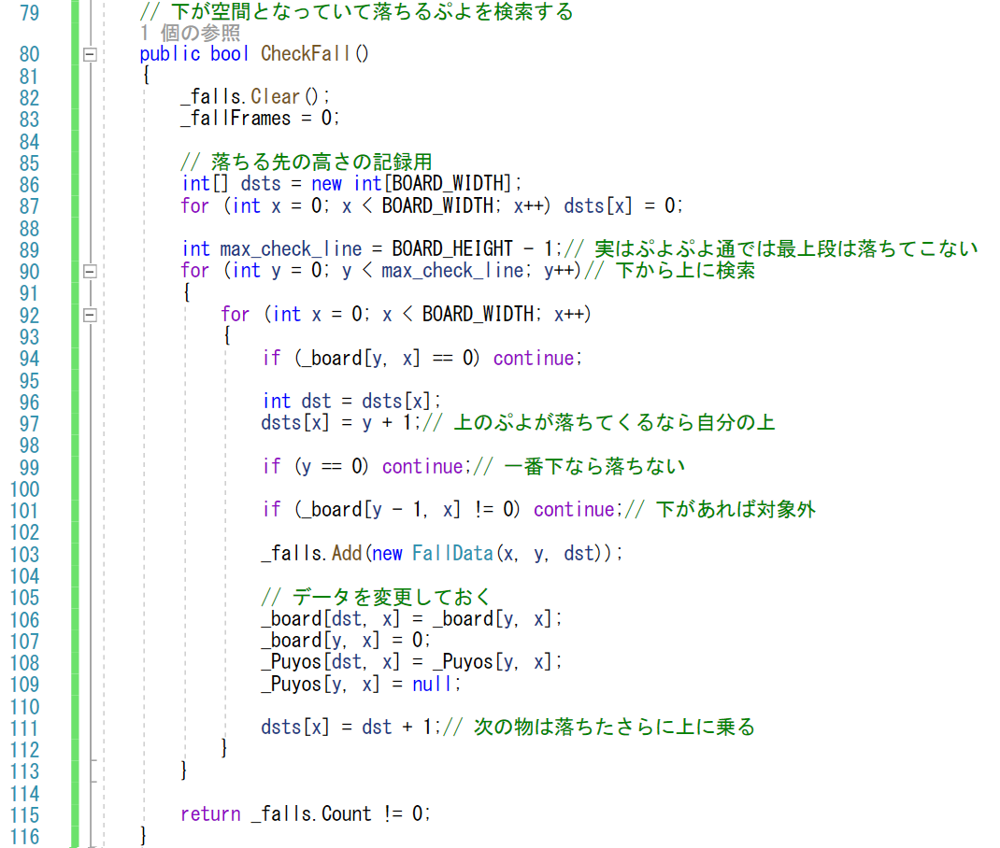
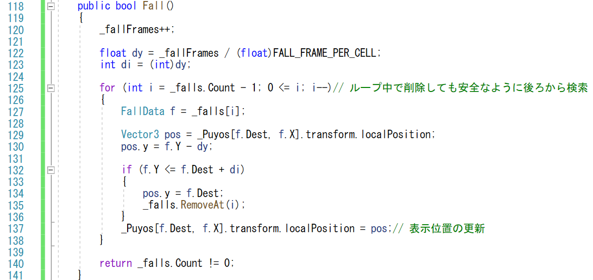

# 概要
ぷよぷよでは、横にしてぷよを置いたときなどに、その下が空間であれば、ぷよは切り離されて下に落ちてきます。
このように、ぷよが固定された際に、その下が空間だったら一定速度で真下に落としてみましょう。
今回の処理は、対戦プレイで相手にぷよを送る際や、最初の状態としてぷよを上から降らすときにも使えます。

https://user-images.githubusercontent.com/936545/154976247-f77f8bce-43b3-405e-b96b-b3e55875b772.mp4

# 手順

ぷよぷよを固定したときに、下が空間であれば一定速度で落ちてくる処理ですが、
これは、ぷよが固定された後、次のぷよが落ちてくる間に、キー操作を受け付けることなく展開される演出なので、
PlayDirectorに、落ちるぷよがあれば落とす
状態として状態を追加するのが良さそうです。

前回導入したIStateを派生させた状態を追加して、落とす演出を
追加していきましょう。

## Fallingステートの追加
まずは、PlayDirector.csの編集です。

ステートの種類を IState.E_Stateに追加します。
具体的には、Fallingという状態を追加します(12行目)。

また、Falling状態のクラスを作ります。
FallingStateクラスとしますが、このクラスをstatesのクラス配列に追加します(40行目)。
なお、配列への追加を行わないとエラーが表示されるので、
忘れても直ぐに気付くはずです。

このFalling状態に関する遷移ですが、
Control状態からぷよが下に何もなくて固定されれば、
Falling状態へ遷移します。

逆に、Falling状態から他の状態への遷移ですが、
初期化として落ちるぷよがあるか調べて、
もし落ちるぷよがなければControl状態に行けば良さそうです。
また、更新処理Updateでぷよを落として、
全てのぷよが下に着地してもControl状態に戻せばよいように思います。

従って、ControlStateクラスのUpdateメソッドで、
プレイヤーが非アクティブになれば、Falling状態に遷移します(101行目)。

実は、最初にぷよが降ってくる時まで想定すると、
状態の最初はControlStateではなくFallingStateの方が望ましいです。
従って、_current_stateをFallingで初期化します(36行目)。

## Fallingステートの実装

次に、FallingStateクラスの中身を見ていきましょう(115-124行目)。
PlayDirectorでは複雑な処理は行いません。
PlayDirectorは、ゲームプレイの流れの指示に専念することにして、「落ちるぷよがあるか判断する」、「ぷよを特定の速さで落とす」といった具体的な処理は、別のクラスに任せることにします。
BoardControllerクラスが、どのようなぷよが盤面にあるのかを管理しているので、BoardControllerクラスに任せようとおもいます。実際的には、次のメソッドをBoardControllerクラスに追加します。

- CheckFall: 下が空間になっているぷよを検索する
- Fall: 浮いているぷよをすこしづつ落とす

PlayDirectorではそれらを呼び出し、返り値として落ちるぷよがまだ残っているか受け取る事で、状態の遷移に繋げます。両方のメソッドとも、返り値としてまだ落ちるぷよがあれば状態を変えず、落ちるぷよがなくなったところで、Controlステートに遷移させます(119, 122行目)。

なお、BoardControllerクラスは、PlayDirectorスクリプトでは
まだ見れる状態にありませんでした。
BoardControllerスクリプトは、PlayDirectorスクリプトと同じBoardゲームオブジェクトにバインドされているので、GetComponent で取得することにします。
次の処理を追加します。

- メンバーの追加(30行目)
- GetComponentでスクリプトを取得(47行目)
- 設定漏れがない様にRequireComponentを追加(24行目)

最後のRequireComponentですが、これをつけることで、GetComponetした時にスクリプトが見つからないというような
間違いを防ぐことができます。

## 落ちるぷよの検索

では、ボードコントローラの中身を実装していきましょう。
この後は、BoardController.cs を修正します。

## 落ちる情報の管理

落ちるぷよですが、何個落ちるのかという事はわかりません。
また、どのぷよが落ちるのかという事だけではなく、どこからどこまで落ちるのかという情報管理しなくてはなりません。

落ちる際の情報を管理するのに、構造体を定義したいと思います。
どこ(X, Y)にあるぷよがどの位置まで落下するのかという情報を保持します。
今回は、「FallData」という名前を付けました。
落ち始めの時間と、落ち始めてからの経過時間で、どの位置に表示するのかという事は計算できるので、落ちている途中の位置の情報を保持する必要がはありません。

FallData はリストで管理します。
BoardController のメンバーに FallData のリスト _falls を追加しました(30行目)。
また、落ち始めからの時間を保持するメンバー _fallFrames も追加しました。
なお、落ちる速さも BoardController に持たせています。
FALL_FRAME_PER_CELL を大きくすると速く落下します(20行目)。

_falls リストに落ちるぷよを登録するのが、「CheckFall」メソッドです。
CheckFall メソッドでは、2重ループ(90,92行目)回して、
すべてのぷよを調べて、その下が空間だったら(101行目)、_falls にFallDataのデータを追加します(103行目)。

なお、落ちる先の位置は、同じ列の下から詰まっている場所の上になります。
列ごとで決まるので、各列に自分より下にあるぷよの数を格納する変数dstsを用意して、列が分かればO(1)でどこに落ちるかすらベラれるようにしています(86行目)。
dstsは、ぷよを下の列から調べていった際に、各行のぷよが動かないのであれば、次の落ちてくるのは自分の上の場所に(97行目)、
自分が落ちるのであれば、落ちた行の上の場所を記録します(111行目)。

なお、ぷよぷよ通では、下から14行目にぷよが固定されると、
そのぷよは落ちてこないという仕様があります。
今回は、この現象を再現するために、高さ方向の検索を、
最上位の一つ手前で止めるようにしています(89-90行目)。

なお、実際にその場所にぷよがいるか判断するためのメンバー _board は、CheckFall メソッドで落ちるぷよが判明した時に、更新します(106-107行目)。
この後のFallメソッドでは、内部のデータの位置は変えず、見た目の位置だけ、等速に落下しているように見せます。
このような、見た目と内部のデータの情報が一致しないのは、今回のような演出ではよくあることです。内部のデータは、データが途中で消えたり変更しないかという堅牢制を気にして処理する一方、見た目に関するデータはなるべく派手な演出をするのが望ましいです。その結果、データの値が部分的に合わないタイミングというのがあったりするので、どこでどのデータを使うのか・どこで更新するのか、という事はきちんと考えて、確実に把握しておきましょう。
なお、表示するゲームオブジェクトを管理する配列_Puyosも、
最初の落ちるぷよを検索する際に、落ちるのであれば配列情報だけ先に移動しておきます(108-109行目)。

## 一定速度で落とす

見た目的に落とす処理が、Fall メソッドです。
Fall メソッドでは、落ち始めの時刻からのフレーム数から、下に動いた量を計算します(120-123行目)。

リストに登録されたぷよに関して、今回のフレームまでで下に動いた位置を計算して(130行目)、それが落ちて固定されるはずの位置よりも下であれば(132行目)、位置を落ちた丁度の高さに合わせて(134行目)、リストから削除します(135行目)。
そうでなければ、下に動いた位置にゲームオブジェクトの位置も変更します(137行目)。

なお、リストをなめている際にリストの要素を外すと、
その後の要素の位置が変わってきます。このような動的な組み換えが入ると不具合を起こしやすいです。
今回は、リストを後ろから検索するようにしました(125行目)、途中で要素を削除したとしても確実に自分の一つ前が前の要素になるので、動的な要素数の(双方向)リストですべての要素を飛ばさずに処理することが可能です。

# 検証

ぷよを半分だけ浮かせて固定した時に、浮いている方が下に落ちれば正解です。

